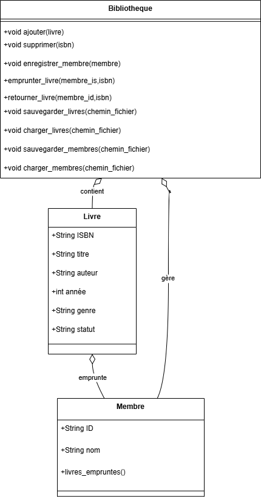
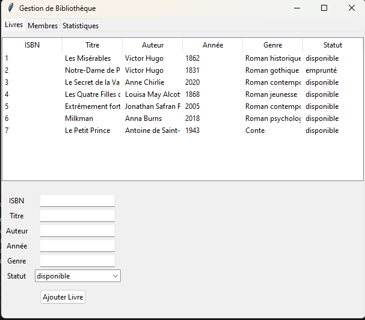
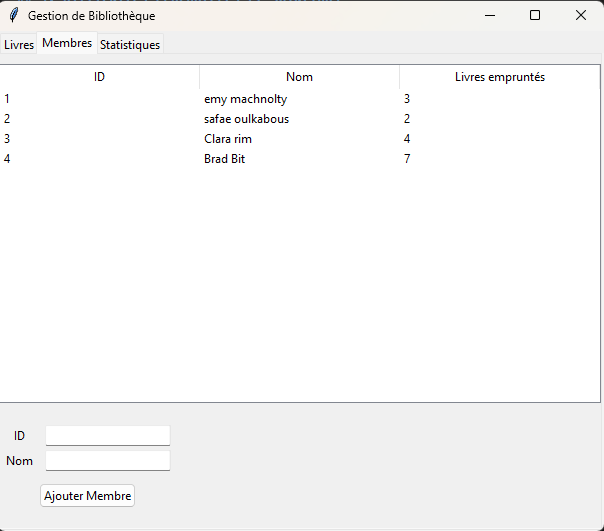
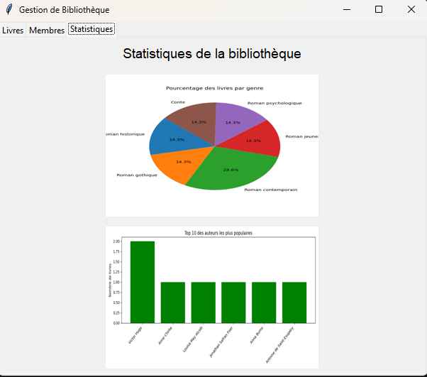

# Application de Gestion de Bibliothèque

## 1. Présentation Générale        
L'application de gestion de bibliothèque est un projet Python conçu avec une interface graphique en Tkinter. Elle permet de gérer les livres, les membres et de visualiser des statistiques liées à la bibliothèque.

## 2. Objectifs

Développer une application complète de gestion de bibliothèque en Python qui intègre :

- Un backend POO pour la logique métier
- La gestion des exceptions pour les erreurs métier
- La persistance des données dans des fichiers
- La génération de rapports statistiques avec Matplotlib
- La persistance des données (fichiers JSON/CSV)

## 3. Technologies Utilisées

- Python 3.13
- Tkinter (interface graphique)
- Matplotlib (génération de graphiques)
- Pillow (affichage d'images)
- Pandas (analyse de données pour les statistiques)

## 4. Diagramme de classe UML

## 5. Architecture du Projet

Le projet est organisé en plusieurs dossiers pour une meilleure clarté :

Gestion_Bibliotheque_Oulkabous/
├── assets/
│ ├── presentation.mp4
│ ├── stats_auteurs.png
│ └── stats_genres.png
├── data/
│ ├── historique.csv
│ ├── Livres.txt
│ └── membre.txt
├── docs/
│ └── rapport.pdf
├── src/
│ ├── bibliotheque.py
│ ├── exceptions.py
│ ├── gui.py
│ ├── main.py
│ └── visualisations.py
├── README.md
└── requirement.txt

## 6. Description des Modules

### 6.1. main.py

Le point d'entrée de l'application. Il initialise la fenêtre principale et appelle `BibliothequeGUI`.

### 6.2. gui.py

Contient la classe `BibliothequeGUI` qui construit l'interface graphique avec trois onglets :

- **Livres** : formulaire d'ajout des livres et une liste qui affiche les livres et leurs états.
- **Membres** : formulaire d'ajout des membres et une liste qui affiche les informations des membres.
- **Statistiques** : affiche 2 graphiques (genre, auteurs).

### 6.3. bibliotheque.py

Définit les classes :

- `Livre` (ISBN, titre, auteur, année, genre, statut)
- `Membre` (ID, nom, livres empruntés)
- `Bibliotheque` (gestion et ajout des livres/membres + chargement/sauvegarde des données)

### 6.4. visualisations.py

Génère les fichiers PNG de statistiques à l'aide de `matplotlib` et `pandas` à partir des fichiers :

- `Livres.txt`
- `historique.csv`

### 6.5. exceptions.py

Contient des exceptions personnalisées pour gérer les cas d'erreur.

## 7. Capture d’écran des visualisations

## 8. Fonctionnalités

- Ajout de livres avec formulaire : saisie d’ISBN, titre, auteur, année, genre, statut.
- Ajout de membres avec saisie d'ID et nom.
- Lecture des fichiers de données `Livres.txt` et `membre.txt` au démarrage.
- Visualisation de statistiques avec génération automatique de graphiques PNG.

## 9. Difficultés rencontrées et solutions

**Problème :**

Lors de l’affichage des statistiques, le programme levait une erreur `FileNotFoundError` car il cherchait les images dans le dossier `src/assets`, alors qu'elles étaient dans `Gestion_Bibliotheque_Oulkabous/assets`.

**Cause :**

Dans le code, les chemins vers les fichiers images étaient relatifs au dossier `src`, alors que le dossier `assets` se trouve à la racine du projet.

**Solution :**

J’ai simplement lancé le programme directement depuis la racine (`Gestion_Bibliotheque_Oulkabous`) avec la commande suivante :
python src/main.py

## 10.Vidéo de Présentation
Une vidéo presentation.mp4 est disponible dans le dossier assets/ pour démontrer les fonctionnalités principales.

## 11. Conclusion
Cette application constitue un projet complet qui combine la programmation orientée objet, la gestion de fichiers, l’interface utilisateur graphique et l’analyse de données. Elle est simple, modulaire et extensible.

 # J ai fait le rapport sous cette forme car j ai rencontre des problemes lors du push du pdf vers github
